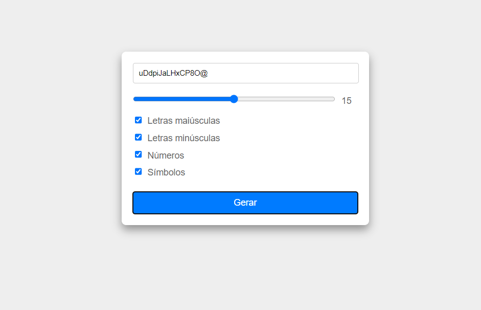

## Projeto: Gerador de Senha

Um gerador de senhas é uma aplicação web projetada para criar senhas fortes e seguras para os usuários. O objetivo principal dessa ferramenta é fornecer uma maneira conveniente e eficiente de gerar senhas que sejam difíceis de serem adivinhadas ou quebradas por ataques de força bruta, aumentando assim a segurança das contas online dos usuários.

